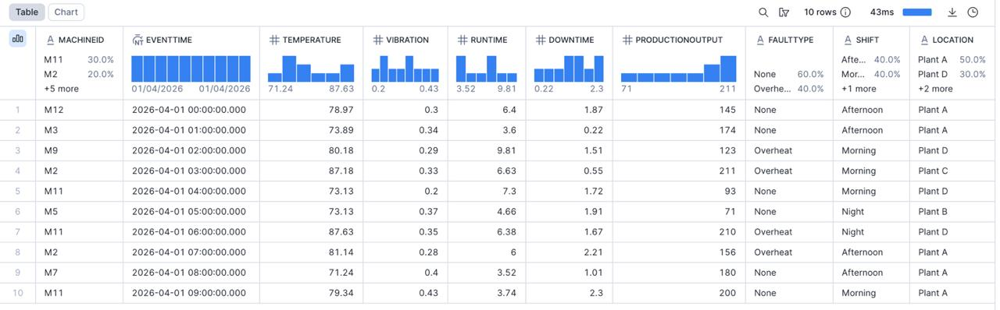
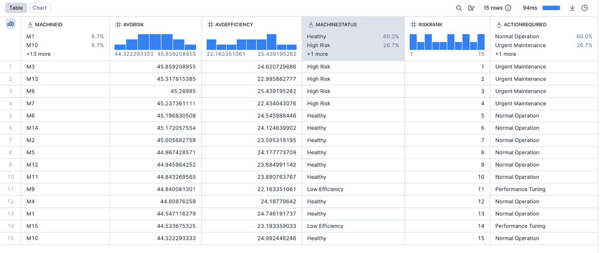
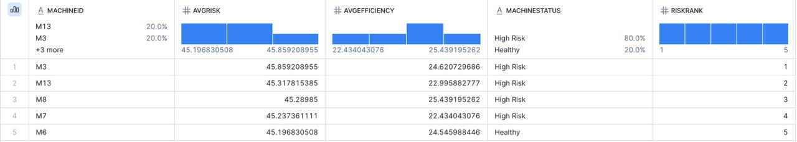
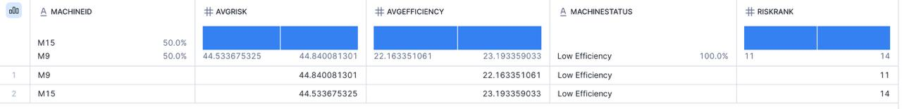
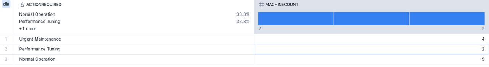

# 🚀 Industrial IoT Analytics Platform

💡 A smart analytics system to monitor machine health, analyze risk, and optimize industrial performance using Snowflake.

---

## 📊 Overview

Industrial IoT Analytics Platform is a Snowflake-based data analytics system designed to process machine sensor data and generate actionable insights.

It analyzes machine behavior using temperature, vibration, runtime, and production output.

---

## 🎯 Problem Statement

Machines in industries are often monitored manually, which leads to:

- Unexpected failures  
- Increased downtime  
- Reduced efficiency  

This project helps users:
- Identify high-risk machines  
- Detect low-efficiency machines  
- Plan maintenance efficiently  

---

## ⚡ Features

- Data Warehouse Design:
  - Fact and Dimension tables (Star Schema)

- ETL Pipeline:
  - Load raw machine data  
  - Transform using SQL  
  - Create analytical views  

- Machine Analytics:
  - Risk Score calculation (Temperature, Vibration, Downtime)  
  - Efficiency calculation (Production Output vs Runtime)  

- Machine Classification:
  - Healthy  
  - High Risk  
  - Low Efficiency  
  - Critical  

- Ranking System:
  - Machines ranked based on risk  

- Action Recommendations:
  - Immediate Shutdown  
  - Urgent Maintenance  
  - Performance Tuning  
  - Normal Operation  

---

## 🛠 Tools & Technologies

- Snowflake  
- SQL  
- Data Modeling  
- Window Functions  

---

## 📸 Dashboard Preview

### Raw Data

### Final Dashboard

### High Risk Machines

### Low Efficiency Machines

### Action Summary

---

## 🚀 How to Use

1. Run `1_dbschema.sql`  
2. Load data into `RawMachineData`  
3. Run `2_etl_views.sql`  
4. Run `3_Analysis.sql`  
5. Analyze:
   - Risk  
   - Efficiency  
   - Machine status  

---

## 📁 Project Files

- `1_dbschema.sql` → Database and table creation  
- `2_etl_views.sql` → ETL and analytics views  
- `3_Analysis.sql` → Final queries  
- `screenshots/` → Output images  

---

## 👨‍💻 Author

**Sharan Teja**

---

## 🔥 Key Outcome

This system helps identify risky and inefficient machines, rank them based on priority, and support better maintenance decisions using data.
